<div align="center">
  <a href="https://readstein.com" target="_blank" rel="noreferrer">
    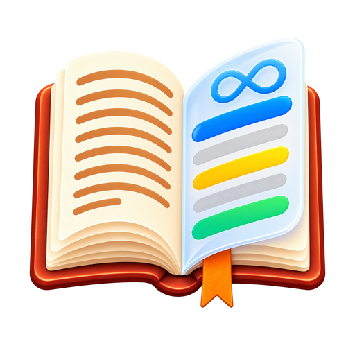
  </a>
  <h1>Readstein</h1>

  Readstein is an open-source ebook reader designed for immersive and deep reading experiences. Built as a modern rewrite of [Foliate](https://github.com/johnfactotum/foliate), it leverages [Next.js 16](https://nextjs.org/) and [Tauri v2](https://tauri.app/) to deliver a smooth, cross-platform experience across macOS, Windows, Linux, Android, iOS, and the Web.

  Readstein is a local-first fork of [Readest](https://github.com/readest/readest), built for people who want to use a nice modern reader app with unlimited storage without any paid subscriptions.

  [![Website][badge-website]][link-website]
  [![Platforms][badge-platforms]][link-website]
  [![AGPL-3.0 License][badge-license]](LICENSE)
  [![Latest release][badge-release]][link-gh-releases]
  [![Last commit][badge-last-commit]][link-gh-commits]
  [![Commit activity][badge-commit-activity]][link-gh-pulse]
</div>

<p align="center">
  <a href="#features">Features</a> •
  <a href="#screenshots">Screenshots</a> •
  <a href="#downloads">Downloads</a> •
  <a href="#documentation">Documentation</a> •
  <a href="#building-from-source">Building from Source</a> •
  <a href="#troubleshooting">Troubleshooting</a> •
  <a href="#support">Support</a> •
  <a href="#license">License</a>
</p>

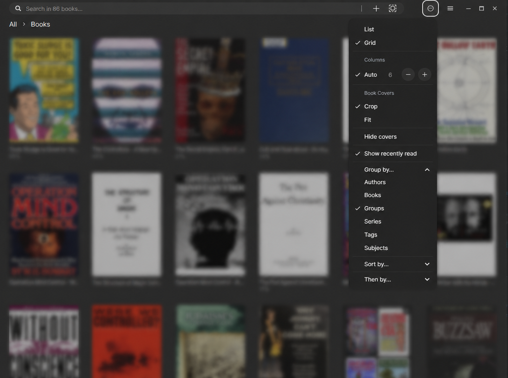

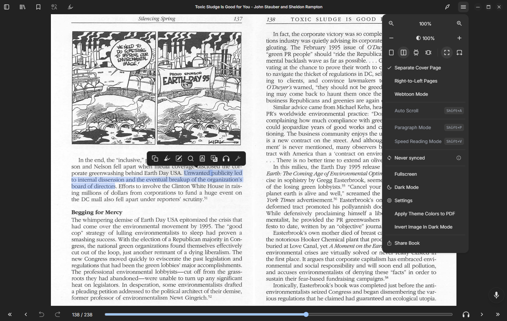

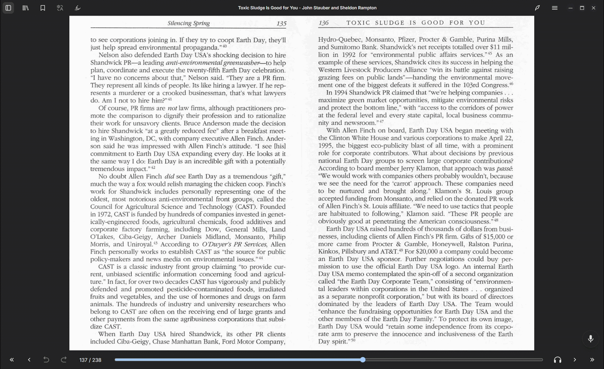


## Features

### A reader built for real personal libraries

| Feature | What it adds |
| --- | --- |
| **No app-imposed local library quota** | Keep large personal collections of EPUBs, PDFs, comics, and documents on your own device. |
| **Home Library** | Run Readstein on a PC as a local library host and pair devices on the same Wi-Fi, without moving the collection to a hosted storage quota. |
| **Bring your own cloud storage** | Connect Google Drive, WebDAV, S3, OneDrive, and other supported providers for personal-library workflows without a Readstein subscription requirement. |
| **Expanded on-device TTS** | Choose from on-device speech models including Kokoro, Piper, and Supertonic, with model sizes, resource requirements, acceleration status, and playback controls. |
| **Better folder workflows** | Create, select, rename, remove, and reorganize library folders; move books quickly between folders while keeping control of the underlying library. |
| **Metadata and cover tools** | Edit book metadata and cover images to make a large mixed-format collection easier to browse and maintain. |
| **Improved AI chat** | Use configurable local or OpenAI-compatible providers for book-aware chat, with provider checks and clear setup guidance instead of raw runtime errors. |
| **Readest foundations** | Keep the features readers expect: EPUB/PDF/MOBI/KF8/AZW3/FB2/CBZ/TXT/Markdown support, annotations, search, dictionaries, translation, OPDS/Calibre support, themes, accessibility, and cross-device reading workflows. |

### Subscription compatibility

You don't need a subscription to use this app, especially with the local computer-hosting and cloud services opened up. Although for maximum compatibility, the official Readest subscription & account system remains in place. So if you want to use the original Readest-hosted services or subscription, those flows remain available in this app as well.

## Screenshots

### Home Library — keep the library on your own PC

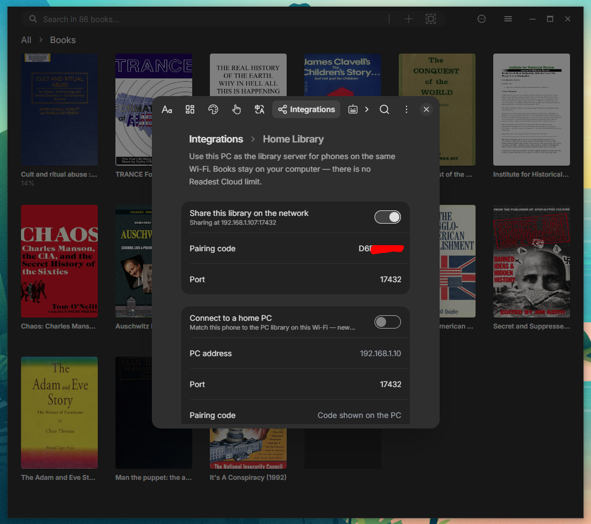

### Google Drive import and sync controls

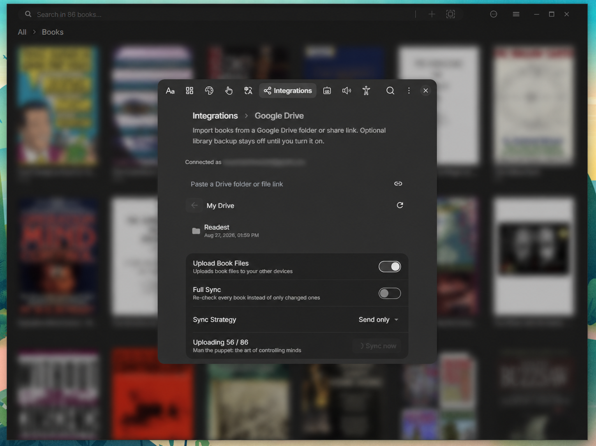

### Local TTS for Mobile & Desktop

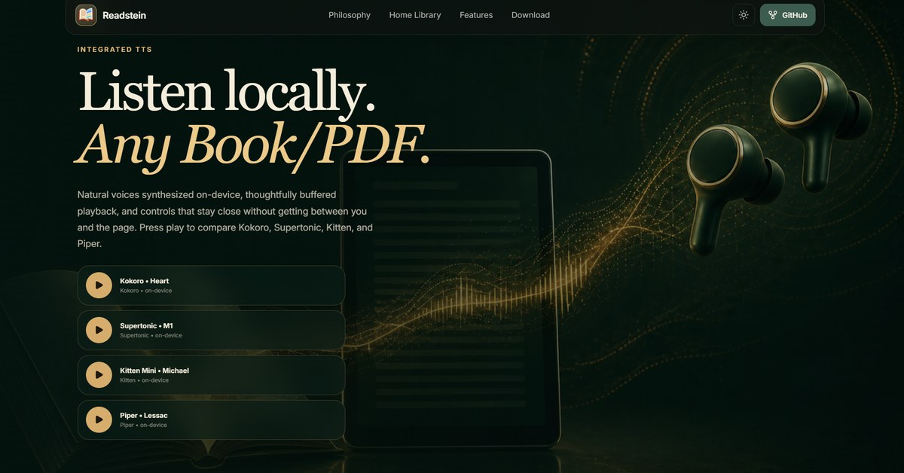

### In-reader TTS playback and controls

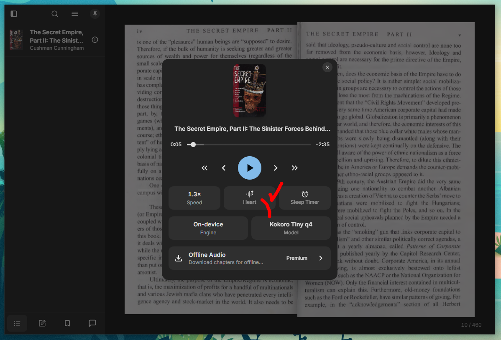

### On-device TTS model selection

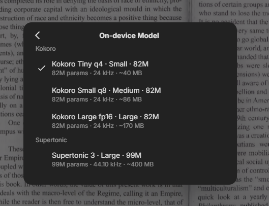

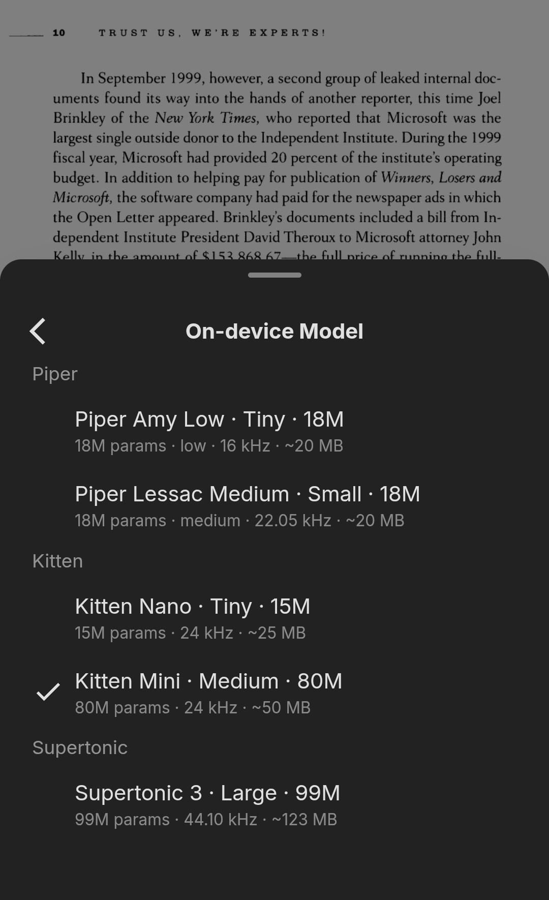

### Folder management for large collections

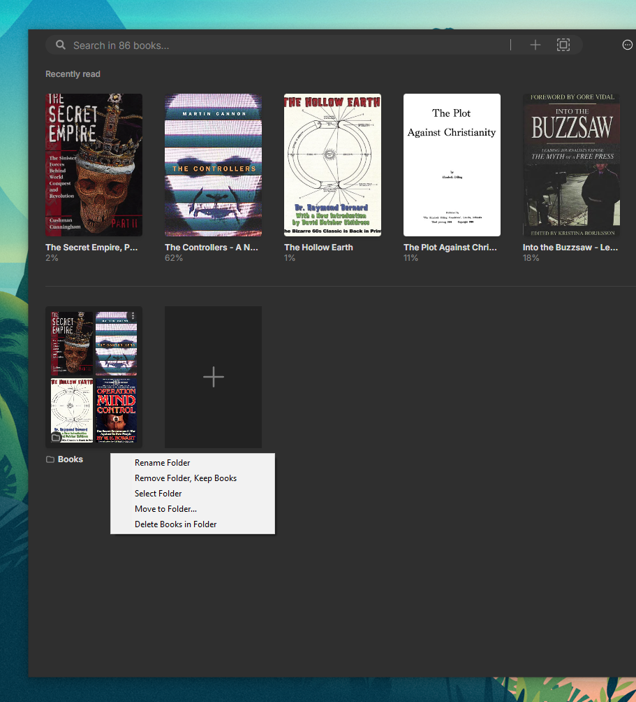

## Downloads

### Windows and Android

For current Windows installers and Android builds, visit [readstein.com][link-website] or the [Readstein releases page][link-gh-releases].

### macOS, Linux, iOS, and iPadOS

Prebuilt distribution is not currently provided for these platforms. Clone this repository and build from source using the instructions below.

## Documentation

The repository is the primary documentation source for Readstein:

- [Architecture](./apps/readest-app/docs/architecture.md)
- [Code layout](./apps/readest-app/docs/code-layout.md)
- [Testing](./apps/readest-app/docs/testing.md)
- [Contributing and development setup](./CONTRIBUTING.md)

## Building from Source

Run commands from the repository root, not from `apps/`.

### Prerequisites

- Node.js and pnpm
- Rust and Cargo
- Tauri prerequisites for your platform

On Windows, confirm that Cargo is available:

```bat
set PATH=%USERPROFILE%\.cargo\bin;%PATH%
```

### First-time setup

```bash
git clone https://github.com/CodeUpdaterBot/Readstein.git
cd Readstein
git submodule update --init --recursive
pnpm install
pnpm --filter @readest/readest-app setup-vendors
pnpm tauri info
```

### Run the desktop app

```bash
pnpm tauri dev
```

### Windows installer

```bash
pnpm tauri build --bundles nsis
```

The generated installer is written under `target/release/bundle/nsis/`.

### Android APK

After installing the Android SDK/NDK and initializing Tauri Android support:

```bash
pnpm tauri android build -t aarch64 --debug
```

The APK is written under:

```text
apps/readest-app/src-tauri/gen/android/app/build/outputs/apk/universal/debug/
```

## Troubleshooting

### Readstein does not launch on Windows

Readstein uses Microsoft Edge WebView2 to render its interface.

1. Open **Apps & features** in Windows and check for **Microsoft Edge WebView2 Runtime**.
2. Install or update WebView2 from [Microsoft's WebView2 page](https://developer.microsoft.com/en-us/microsoft-edge/webview2/).
3. Launch Readstein again.

### AppImage opens but no window appears on Linux

Some Wayland systems can hit EGL compatibility issues. Try launching with the system Wayland client library preloaded:

```bash
LD_PRELOAD=/usr/lib/libwayland-client.so /path/to/Readstein.AppImage
```

If that does not help, build from source for your current environment.

## Support

Readstein is maintained in the open. The best way to help is to:

- [Open an issue][link-gh-issues] with clear reproduction steps.
- Submit a focused pull request.
- Share feedback about large-library, local-first, accessibility, and TTS workflows.
- Star or watch the repository to follow releases and changes.

## License

Readstein is free software, released under the [GNU Affero General Public License v3.0](LICENSE), or (at your option) any later version.

It is a derivative work of [Readest](https://github.com/readest/readest), which is also licensed under AGPL-3.0. See [`LICENSE`](LICENSE) for the full terms.

> [!NOTE]
> Readstein is independently maintained and is not affiliated with, endorsed by, or distributed by Readest or Bilingify LLC. It preserves the app's existing subscription and hosted-service paths for people who choose to use them (to help support & credit the original project), while adding local-first and bring-your-own-storage workflows for personal libraries.

---

<div align="center">Happy reading with Readstein.</div>

[badge-website]: https://img.shields.io/badge/website-readstein.com-0f766e
[badge-platforms]: https://img.shields.io/badge/platforms-macOS%2C%20Windows%2C%20Linux%2C%20Android%2C%20iOS%2C%20Web-0f766e
[badge-license]: https://img.shields.io/badge/license-AGPL--3.0-0f766e
[badge-release]: https://img.shields.io/badge/latest%20release-v0.12.1-16a34a
[badge-last-commit]: https://img.shields.io/badge/last%20commit-a2e45f9-2563eb
[badge-commit-activity]: https://img.shields.io/badge/commit%20activity-active-2563eb
[link-website]: https://readstein.com
[link-gh-releases]: https://github.com/CodeUpdaterBot/Readstein/releases
[link-gh-commits]: https://github.com/CodeUpdaterBot/Readstein/commits/main
[link-gh-pulse]: https://github.com/CodeUpdaterBot/Readstein/pulse
[link-gh-issues]: https://github.com/CodeUpdaterBot/Readstein/issues
